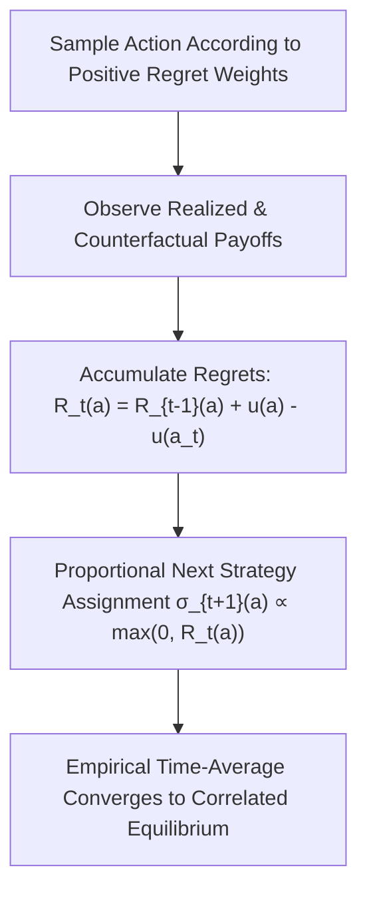

# Regret Matching Learning Dynamics Skill

Hart-Mas-Colell adaptive no-regret learning algorithm converging to the set of correlated equilibria in multi-agent games.

## Features
- **100% Python Standard Library**: Online \(O(1)\) state updates.
- **No-Regret Guarantee**: Average external regret approaches 0 almost surely.
- **Correlated Equilibrium Convergence**: Decentralized multi-agent coordination.
